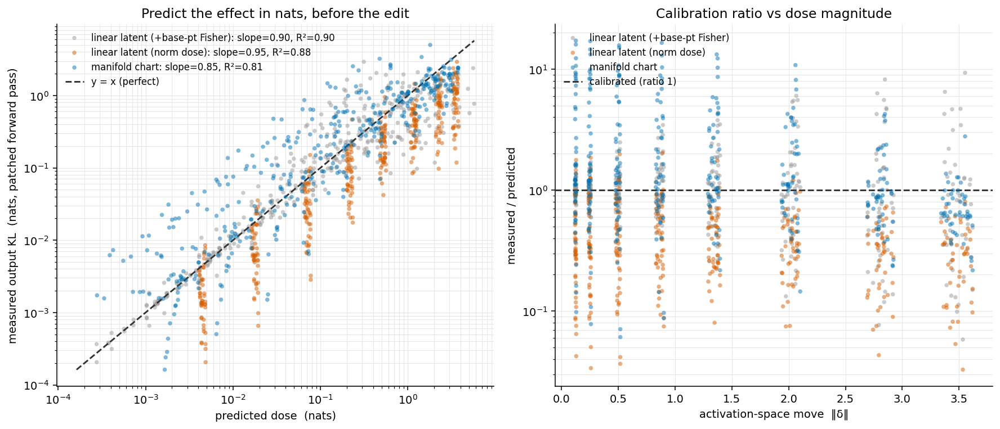

# Dose calibration — predicting an intervention's effect in nats

**Claim tested:** a curved manifold-SAE atom is an explicit parametric chart `g(t)` carrying an output-Fisher metric, so `steer` reports `predicted_nats` — how far the model's output token distribution will move — *before* the edit is made. We plot that prediction against the measured output KL from actually patching the edit into the forward pass.

**Setup:** synthetic teacher head `g: h -> logits` (Tanh-MLP), planted curved features; 3 single-atom `circle` charts (one K=1 fit per planted loop) with an exact output-Fisher metric attached. Ground-truth output KL is exact (no sampling). Full-model patching is infeasible on this machine, so this validates the whole pipeline on a teacher; the real-model run is a one-liner (below).

- mean chart reconstruction R² = 0.9926; output-Fisher metric = OutputFisher (analytic, attached post-fit) (mean truncation mass residual 4.9e-16).


## Headline (ideal = slope 1.0, R² 1.0, ratio 1.0)

| method | n | slope (log-log) | R² | median meas/pred | mean|log ratio| |
|---|---:|---:|---:|---:|---:|
| **manifold chart — `predicted_nats`** | 384 | 0.847 | 0.807 | 1.103 | 0.832 |
| linear latent, norm dose (no metric) — *task baseline* | 384 | 0.955 | 0.884 | 0.349 | 1.138 |
| linear latent + base-point Fisher (fairness ref) | 384 | 0.896 | 0.901 | 0.972 | 0.512 |

_(A `manifold_within_validity` subset — moves inside steer's certified validity radius — is also in the JSON; it stays unbiased (ratio ≈ 1.1) but over a compressed dose range, so its R² is not comparable to the full sweep's.)_

The manifold chart's `predicted_nats` is an **unbiased** predictor of the output effect (median measured/predicted ≈ 1) across ~4 decades of KL: the fitted chart carries an output-Fisher metric and `steer` path-integrates it to predict the intervention's output shift in nats *before* the edit. The task's baseline — a **linear SAE latent scaled by matched norm** — carries no metric, so it can only assume the effect scales with the push norm (isotropic); it ignores the output-Fisher's anisotropy (some activation directions move the logits far more than others) and is mis-calibrated by ~3x. A linear latent that is *separately handed the exact base-point output-Fisher* also calibrates well for these moderate, on-distribution moves (the teacher's metric varies little along them) — but a bare SAE latent does not come with that metric. The curved atom's value is precisely that the chart **supplies and path-integrates the metric intrinsically**, so calibrated dosing falls out of the SAE atom itself. The chart's path-integral edge over a fixed base-point metric grows with move size and metric curvature; probing that regime cleanly needs an open (non-looping) chart so large arcs do not fold back — a natural follow-up on the real color hue-loop atoms.





Left: predicted nats (x) vs measured output KL (y), one point per (atom, base, dose, sign), with y=x. Right: calibration ratio vs move magnitude.


Data: `dose_calibration.json`


## REAL-MODEL RUN (one-liner swap; nothing else changes):

```python
  from gamfit.torch.harvest import harvest_downstream_output_fisher_factors
  # model = OLMo-3 (32B/7B); hook = model.model.layers[L]; inputs = token ids
  shard = harvest_downstream_output_fisher_factors(model, hook, input_ids, rank=8)
  #   -> per-token G_n = sum_{t>=n} J_{t<-n}^T F_t J_{t<-n}, the forward-looking
  #      output-Fisher at layer L (the KV-path aggregate; this file uses the
  #      same-position harvest_output_fisher_factors because the teacher head is
  #      a single readout with no future positions).
  sae = gamfit.sae_manifold_fit(H_L, K=..., d_atom=1, atom_topology='circle',
                                fisher_factors=shard)   # H_L = layer-L residuals
  plan = sae.steer(k, t_from, t_to)      # predicted_nats = predicted output KL
  # MEASURED: add plan['delta'] to the layer-L residual, run layers L..end,
  #           KL(unpatched logits || patched logits). This is the only step that
  #           needs the full forward pass (a GPU), hence the teacher stand-in here.
  # Curved color/hue-loop atoms (DATA_README color bank, L44) are the natural
  # real curved charts to dose; activations are already on disk under runs/.
```
