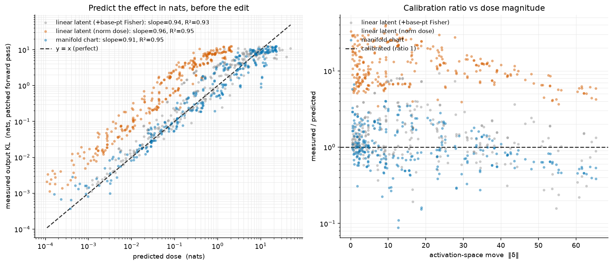

# Real-model dose calibration — predicting an intervention's effect in nats

**Model:** `REAL model llama-3.1-8b-instruct (layer 16); measured output KL = patched forward pass, exact next-token distribution`

**Claim tested:** a curved manifold-SAE atom is an explicit parametric chart `g(t)` carrying a downstream output-Fisher metric, so `steer` reports `predicted_nats` — how far the model's output token distribution will move — *before* the edit. We plot that prediction against the **measured** output KL from actually patching the edit into the forward pass and re-reading the logits.

**Setup:** layer-16 residual-stream activations at calendar-token sites (weekday); one K=1 `circle` chart per feature with the downstream output-Fisher metric attached (`harvest_downstream_output_fisher_factors`, the exact real-model call). Feature token is the last position, so the measured KL is the clean next-token-distribution shift. Per-template demeaning before geometry (W7 recipe).

- mean chart reconstruction R² = 0.9231 over 1 atoms.

## Headline (ideal = slope 1.0, R² 1.0, ratio 1.0)

| method | n | slope (log-log) | R² | median meas/pred | mean|log ratio| |
|---|---:|---:|---:|---:|---:|
| **manifold chart — `predicted_nats`** | 288 | 0.911 | 0.952 | 0.882 | 0.517 |
| linear latent, norm dose (no metric) — *task baseline* | 288 | 0.964 | 0.952 | 10.244 | 2.395 |
| linear latent + base-point Fisher (fairness ref) | 288 | 0.940 | 0.928 | 1.281 | 0.557 |

Left: predicted nats (x) vs measured output KL (y), one point per (atom, base, dose, sign), with y=x. Right: calibration ratio vs move magnitude.

Data: `dose_calibration_real.json`
