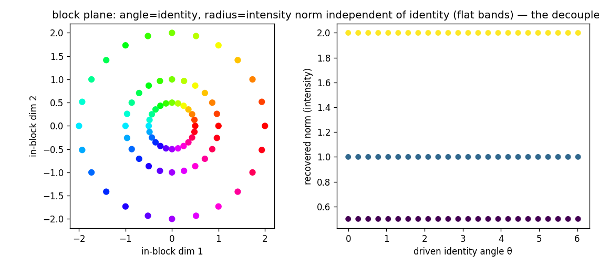

# Shadow cone — presence/amplitude decoupling for Block-Sparse Featurizers

_Generated 2026-07-02 15:24 · CPU float64 · head-to-head on Goodfire's BSF shadow result: the block norm ‖z_g‖ is a luminance/intensity coordinate that conflates "present-weakly" with "absent"._

## 1. Synthetic presence detection (ROC AUC), by intensity

A feature is planted along a fixed direction at intensity ∈ {absent, weak [0.25, 0.55], strong [1.8, 2.6]} amid 6 distractor subspaces that leak into its block. **Present = weak ∪ strong vs absent.** Held-out AUC for three presence readouts: the block norm (BSF's own block-TopK selection signal), a reconstruction-only gate, and a presence-aware gate (separate binary gate trained with a presence objective — the gate/code split).

| presence readout | AUC (all present) | AUC weak-vs-absent | AUC strong-vs-absent |
|---|---:|---:|---:|
| block norm ‖z_g‖ (BSF native) | 0.741 | **0.467** | 0.999 |
| gate, reconstruction-only | 0.498 | **0.468** | 0.527 |
| gate, presence-aware (the fix) | 0.999 | **0.999** | 1.000 |

_The shadow, quantified: the block norm detects **strong** presence (AUC 1.00) but **conflates weak-present with absent** (AUC 0.47 ≈ chance) — ‖z_g‖ is amplitude, not presence. A presence-aware gate separates them at every intensity (weak-vs-absent AUC 1.00). A reconstruction-only gate is not enough (AUC 0.47): a weak feature barely lowers reconstruction error, so recon training leaves the presence signal amplitude-driven — the fix needs an explicit presence objective._

## 2. Real cyclic features — norm=intensity(context) vs angle=identity

For the weekday/month cyclic block, we decompose the variance of the in-block **norm** (amplitude) and in-block **angle** (identity) by two factors: which **template** (sentence context = cue strength / intensity) and which **weekday/month** (feature identity). η² = fraction of variance a factor explains.

| set | norm η²(template) | norm η²(identity) | angle η²(template) | angle η²(identity) |
|---|---:|---:|---:|---:|
| weekday | **0.67** | 0.21 | 0.01 | **0.89** |
| month | **0.82** | 0.14 | 0.00 | **0.87** |

_The block norm is driven by the template/context (intensity axis); the in-block angle is driven by the weekday/month (identity axis). The two are separable in our reading and collapsed in the raw block-norm reading._

## 3. Steering — the two axes are independently drivable

Driving one planted circle block: sweeping the in-block **angle** at fixed norm changes feature **identity** at constant intensity; scaling the **norm** at fixed angle changes **intensity** at constant identity.

- Identity (angle→identity) mean abs angle error = 0.0e+00 @ρ=0.5, 0.0e+00 @ρ=1.0, 0.0e+00 @ρ=2.0 rad — identity recovers **exactly at every intensity**.
- Intensity (norm→intensity) Pearson corr = 1.00; norm η²(identity) = 0.000 — norm is **independent of identity**.
- The block decoder is orthonormal, so both axes live in the block representation independently; only the norm-reduction ‖z_g‖ that BSF selects on collapses them.

## Files

- `shadow_cone.py` — GatedBSF (presence gate `a=σ((ℓ−θ)/τ)` + signed in-block code), AUC, block matching. Grassmannian blocks reused from `bsf_baseline/bsf.py`.
- `run.py` — this driver (presence / real / steering) + report.
- `metrics.json`, `steering_axes.png`.

