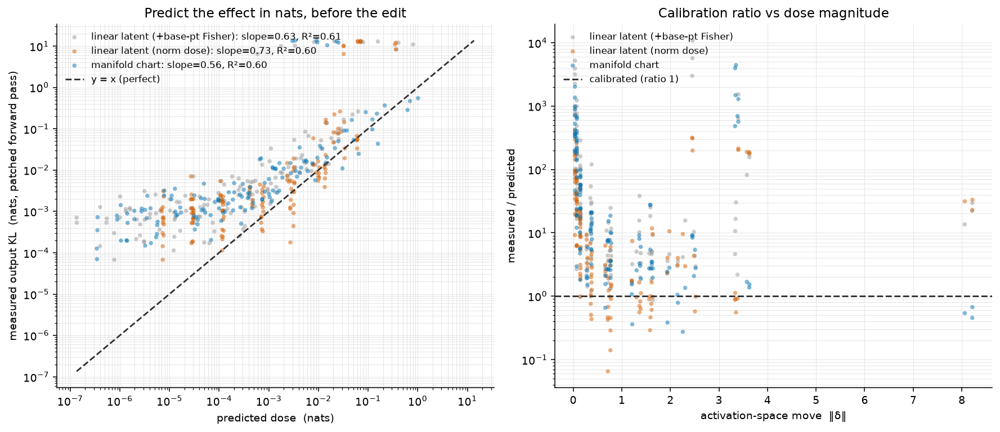

# Real-model dose calibration — predicting an intervention's effect in nats

**Model:** `REAL model qwen3.6-35b-a3b (layer 17); measured output KL = patched forward pass, exact next-token distribution`

**Claim tested:** a curved manifold-SAE atom is an explicit parametric chart `g(t)` carrying a downstream output-Fisher metric, so `steer` reports `predicted_nats` — how far the model's output token distribution will move — *before* the edit. We plot that prediction against the **measured** output KL from actually patching the edit into the forward pass and re-reading the logits.

**Setup:** layer-17 residual-stream activations at calendar-token sites (weekday); one K=1 `circle` chart per feature with the downstream output-Fisher metric attached (`harvest_downstream_output_fisher_factors`, the exact real-model call). Feature token is the last position, so the measured KL is the clean next-token-distribution shift. Per-template demeaning before geometry (W7 recipe).

- mean chart reconstruction R² = 0.8017 over 1 atoms.

- **dose mode = `on_chart_amplitude_normalized`.** ON-CHART, amplitude-normalized. The demeaned calendar signal is O(30) on a ~96-norm residual, so the fitted circle has a genuine radius; the prior run's sub-measurable ~1e-7 move was caused by steer's presence weight `amplitude` (~1e-6 for this K=1 atom) scaling the whole displacement. We divide it out consistently: patched move = steer.delta/amplitude = the real chart displacement g(t1)-g(t0); predicted_nats = steer.predicted_nats/amplitude^2 = the Fisher path integral along that SAME arc. Doses target a fraction of ||h|| by inverting the chord for the chart radius R (clamped to the diameter 2R). predicted_nats_tangent (1/2 c_tan m^2) is recorded for the same move as the local-quadratic reference.

## Headline (ideal = slope 1.0, R² 1.0, ratio 1.0)

| method | n | slope (log-log) | R² | median meas/pred | mean|log ratio| |
|---|---:|---:|---:|---:|---:|
| **manifold chart — HELD-OUT edits** | 70 | 0.559 | 0.691 | 5.786 | 2.373 |
| manifold chart — all edits | 140 | 0.558 | 0.602 | 10.023 | 2.909 |
| manifold chart — within validity radius | 50 | 0.332 | 0.561 | 32.165 | 3.496 |
| linear latent, norm dose (no metric) — *task baseline* | 140 | 0.732 | 0.604 | 5.159 | 2.081 |
| linear latent + base-point Fisher (fairness ref) | 140 | 0.632 | 0.613 | 16.470 | 3.226 |

Left: predicted nats (x) vs measured output KL (y), one point per (atom, base, frac, sign), with y=x. Right: calibration ratio vs move magnitude.

Data: `dose_calibration_real.json`
