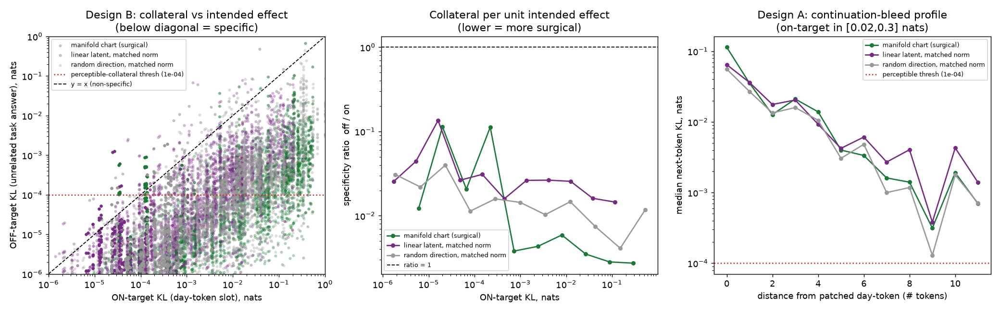

# Steering with specificity - on-target vs OFF-target nats

**Model:** REAL qwen3-8b (layer 18); weekday circle chart (R2=0.9970). 20 day-token bases, 15 unrelated tasks.

**Claim:** a chart-dose edit is *surgical* - it moves the intended (weekday) output slot by a predicted amount of nats while leaving unrelated, day-independent behaviour (arithmetic, facts, code) nearly untouched. On-target KL is read at the patched day-token slot (reproduces the calibrated crown number); off-target KL is read at the answer slot of an interleaved unrelated task, with the SAME patch.

- **Crown-consistency check:** median |on_bare - on_composite| / on_bare = 4.33e-05 (the composite reproduces the standalone on-target KL - the suffix does not change the prefix day-token activation).

- **Empty-splice control (noise floor):** max over all 19800 cells = 0.0e+00 nats -- i.e. **bit-exact 0**. A zero delta run through the identical splice-hook (stack/reshape + `+0`) reproduces the clean logits bitwise, so the hook is faithful and there is *no* measurement-noise floor to subtract: every off-target nat below is genuine collateral. (This is the fix for the earlier `nan`/`1e-30`/`100%-detectable` artifacts, which came from dividing/comparing against a zero floor.) 'Detectable collateral' is therefore flagged against an absolute negligibility threshold of 1e-04 nats.

## Collateral bound at matched on-target bands (Design B)

Per intended-effect level: geo-mean and median off-target KL, the specificity ratio (off/on), and the fraction of edits whose off-target exceeds the perceptibility threshold (1e-04 nats). Ideal surgical dial: off-target small in absolute nats, ratio much less than 1, few edits perceptible.

| on-target band | method | n | off-target (geomean) | off-target (median) | ratio off/on | %>1e-4 |
|---|---|---:|---:|---:|---:|---:|
| ~0.01 | manifold chart (surgical) | 345 | 5.98e-05 | 5.31e-05 | 0.00511 | 41% |
| ~0.01 | linear latent, matched norm | 375 | 0.000201 | 0.000263 | 0.0203 | 72% |
| ~0.01 | random direction, matched norm | 435 | 0.00013 | 0.000134 | 0.0125 | 58% |
| ~0.1 | manifold chart (surgical) | 345 | 0.000341 | 0.00035 | 0.00297 | 80% |
| ~0.1 | linear latent, matched norm | 165 | 0.0019 | 0.00205 | 0.0189 | 92% |
| ~0.1 | random direction, matched norm | 255 | 0.00037 | 0.000377 | 0.00396 | 85% |
| ~0.3 | manifold chart (surgical) | 525 | 0.000978 | 0.000857 | 0.00344 | 91% |
| ~0.3 | linear latent, matched norm | 0 | - | - | - | - |
| ~0.3 | random direction, matched norm | 225 | 0.00237 | 0.00235 | 0.00808 | 92% |

Left: off-target vs on-target KL per edit; red dotted = perceptibility threshold; below the y=x diagonal = specific. Middle: collateral per unit intended effect. Right: how far the edit bleeds into a day-neutral continuation.

**Reading the bound:** for a weekday edit steered to X nats on-target, collateral on unrelated tasks is bounded by the off-target column. The manifold chart's specificity ratio (off/on) is the surgical figure of merit; compare it across methods at matched on-target effect.

Data: `spec_specificity.json`
